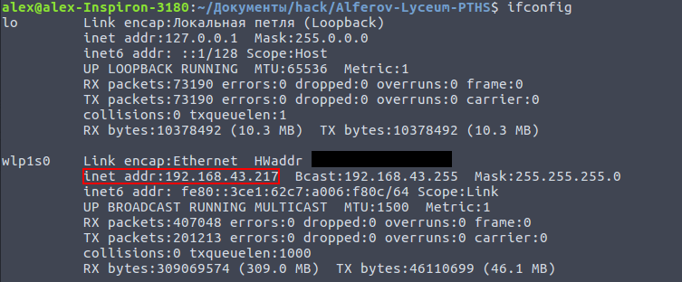
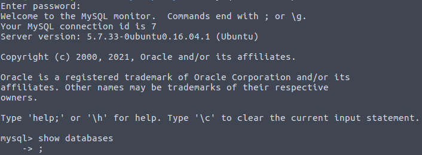

# How to set up a server?
#### A small intro
 * It will be a local server launched on current workstation
 * You should use Linux, but there are also similar command in Windows or mac
 * we will use apache2, php7.0+ and MySQL
   * install on Linux: 
       ```bash
       sudo apt update
       sudo apt install apache2
       sudo apt install php7.0 php7.0-fpm php7.0-mysql libapache2-mod-php
       ```
## The instructions:
 1) open terminal
    * `Ctrl+Shift+T` on Linux
    * `Win+R` and then type `cmd` in the window on Windows
 2) type `ifconfig` in the terminal on Linux (`ipconfig` on Win)
    in my case I got that: 
    
 3) Now we should note that our computer has ip-address `192.168.43.217` in local network
 4) We will run the server on port #1000, so the final url is: `http://192.168.43.217:1000/`
 5) Setting up HTTP server (following instructions works only on Linux):
    1. create a file `/etc/apache2/sites-available/hack.conf`
    2. insert following code there:
    ```apacheconf
    Listen 1000

    <VirtualHost *:1000>
        ServerAdmin admin@site
        ServerName site
        DocumentRoot /var/www/hack/
        ErrorLog /var/www/hack/log/error.log
        CustomLog /var/www/hack/log/access.log combined
        <Directory "/var/www/hack/">
            AddHandler cgi-script .php
            Options +ExecCGI -MultiViews +SymLinksIfOwnerMatch
            Require all granted
            AllowOverride None
        </Directory>
    </VirtualHost>
    ```
    3. Execute following commands:
    ```bash
    sudo mkdir /var/www/hack
    sudo chmod 777 /var/www/hack
    sudo mkdir /var/www/hack/log 
    sudo chmod 777 /var/www/hack/log
    ```
    4. Execute following commands:
    ```bash
    sudo systemctl stop apache2.service
    sudo systemctl start apache2.service
    sudo systemctl enable apache2.service
    sudo a2ensite hack
    sudo service apache2 restart 
    ```
    5. Now we have working HTTP server `http://192.168.43.217:1000/` showing today's date if we view it in a browser
 6) Setting up MySQL server (Linux):
    1. install MySQL if it does not exist
    ```bash
    sudo apt install mysql-server
    sudo mysql_secure_installation
    ```
    2. run this:
    ```bash
    mysql -u <your current user|root> -p
    ```
    3. now we are in MySQL interactive shell
    
    4. execute these commands one by one:
    ```sql
    CREATE DATABASE kettle;
    
    CONNECT kettle;

    CREATE TABLE IF NOT EXISTS kettles (
        id       INTEGER,      -- id of a teapot
        room     VARCHAR(100), -- id of a room
        time     INTEGER,      -- time when a teapot will be biold
        volume   INTEGER       -- volume of water in teapot
    ) CHARACTER SET=utf8;
    
    EXIT;
    ```
    5. so, we set up a MySQL server
  7) Finally, `http://192.168.43.217:1000/` is fully ready for work